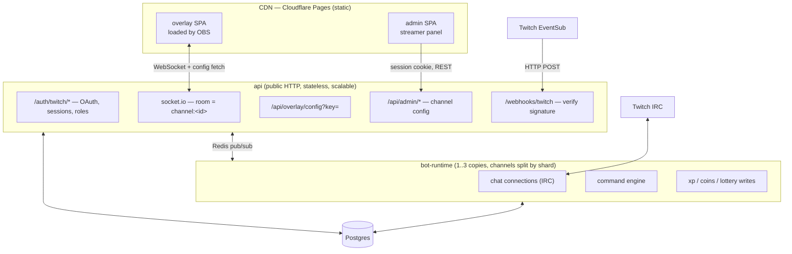

# Backend — Multi-Tenant Platform Architecture

> _Generated by plan from **Evgenii Perov** 🧑‍💻 with the Claude Code robot 🤖 ৻( •̀ ᴗ •́ ৻) ♡_

> **Status:** proposal / target. Nothing here is implemented yet.
> **Audience:** junior — every Twitch term, every architectural word is explained the first time it appears. Trade-offs are stated, not hidden.
> **Scope:** turning today's one-channel bot into a platform serving 50–500 streamers, with an admin panel and a per-channel OBS overlay.
> **Companion doc:** [`possible-architecture.md`](./possible-architecture.md) covers the *inside* of the backend (layers, modules, error handling). This doc covers the *outside*: how many services, which database rows, what talks to what.

---

## Contents

1. [What exists today](#1-what-exists-today)
2. [Vocabulary](#2-vocabulary)
3. [Where we want to go](#3-where-we-want-to-go)
4. [Target architecture](#4-target-architecture)
5. [Twitch limits that shape the design](#5-twitch-limits-that-shape-the-design)
6. [Repository layout](#6-repository-layout)
7. [Data model](#7-data-model)
8. [How things flow](#8-how-things-flow)
9. [Sizing and cost](#9-sizing-and-cost)
10. [Security](#10-security)
11. [When things break](#11-when-things-break)
12. [What to test](#12-what-to-test)
13. [Build order (6 phases)](#13-build-order-6-phases)
14. [Phase 1 in detail](#14-phase-1-in-detail)
15. [Decisions (resolved)](#decisions-resolved-2026-08-05)
16. [Sources](#sources)

---

## 1. What exists today

Fox Sphere is a Twitch bot for **one** channel (`luckyfoxcode`).

```
apps/backend        one Node process:
                      • Express + Socket.io server   (src/app.ts)
                      • Twitch worker                (src/worker.ts)
                    started together by src/prod.ts
apps/frontend       Vue overlay, shown by OBS as a "browser source"
packages/types      shared TypeScript types for events
packages/shared-schemas   zod validators
```

How a follow reaches the screen today:

```
Twitch ──EventSub──▶ worker.ts ──globalEventBus──▶ forwardEventToBackend()
                                                        │ HTTP POST to localhost
                                                        ▼
                                                     app.ts   io.emit(...)
                                                        │ WebSocket
                                                        ▼
                                                   overlay in OBS
```

What makes this **single-tenant** (serving exactly one customer):

1. Channel and bot identity come from env vars — `TWITCH_USER_ID`, `TWITCH_BOT_ID`, four tokens.
2. The database has no "which channel?" column. `User` holds `coins`, `xp`, `lvl` globally.
3. `io.emit(...)` sends every event to **every** connected overlay.
4. The command prefix (`!t`) is one env var for the whole process.

Point 3 is the dangerous one. The day a second channel exists, channel B's follow alert appears on channel A's stream. That is the single most important thing phase 1 fixes.

---

## 2. Vocabulary

| Term | What it means here |
|---|---|
| **IRC** | the old chat protocol Twitch chat still runs on. `@twurple/chat` connects to `wss://irc-ws.chat.twitch.tv`, sends `JOIN #channel`, receives `PRIVMSG`. This is how the bot reads and writes chat — there is no other way to send chat as a bot |
| **EventSub** | Twitch's event feed: "someone followed", "someone raided", "someone redeemed points". Separate from chat. Delivered either over a WebSocket (today) or as HTTP webhooks (target) |
| **Helix** | Twitch's REST API — used to grant VIP, send announcements, read followers |
| **Scope** | a permission a streamer grants during OAuth, e.g. `channel:manage:vips`. No scope, no API call |
| **Tenant** | one streamer's channel. Every piece of data belongs to exactly one tenant |
| **`channelId`** | the tenant's primary key. Every tenant-owned row and every event carries it |
| **`Viewer`** | a Twitch user as a global identity (id + name). Holds no balance |
| **`ChannelUser`** | that viewer's balance *inside one channel*: coins, xp, level, VIP flags |
| **Socket room** | a Socket.io feature: sockets that joined room `channel:abc` receive only messages sent to `channel:abc` |
| **Overlay key** | a random string in the OBS browser-source URL. It says "this overlay belongs to channel X". Rotatable if it leaks on stream |
| **Shard** | one copy of the bot process holding a subset of channels — e.g. 3 copies × 170 channels instead of 1 × 500 |
| **Pub/sub** | a Redis feature: one service publishes a message on a named channel, any number of other services receive it |
| **SPA** | single-page app — the Vue frontends (overlay, admin panel) |
| **CDN** | a static file host near the user (Cloudflare Pages here). Serves the SPAs; no server code runs there |

---

## 3. Where we want to go

**Target: 50–500 streamers.** Public signup, small SaaS. Explicitly *not* 5,000 — that would need a different design and it isn't the goal.

| Decision | Choice | Why |
|---|---|---|
| Bot account | **one shared bot** joins every channel | one token to refresh, one identity. The alternative — every streamer connects their own bot account — multiplies tokens, chat connections and onboarding steps |
| Viewer economy | **per channel** | coins in channel A are unrelated to channel B. Streamers expect "my channel, my economy" and want to tune their own rates |
| Overlay content | **preset scenes first**, uploads later, editor last | building a file-upload subsystem before anyone uses the product is wasted work |
| Admin login | **Twitch OAuth**; roles owner / moderator / superadmin | one identity source keeps sessions and permissions simple. Discord can be added later as a profile link, not a second login path |
| Database | **one Postgres**, shared by both backend services | they own the same data. Two databases would need a sync mechanism, and config would go stale |
| Services | **two backend apps** — not one, not five | see §4 |
| Hosting | provider-agnostic containers | the Oracle Always-Free VM covers all target load; managed Postgres when real users have data worth losing |

---

## 4. Target architecture



### Why two backend apps and not one

`bot-runtime` holds long-lived chat connections and in-memory counters. `api` is redeployed every time the admin panel changes. In a single process, **every panel deploy disconnects every channel's chat**. Splitting costs one extra container and removes that problem completely.

### Why not five apps

At 500 channels, separate webhook-ingest / socket-gateway / shard-manager services would be four more things to deploy, monitor and debug — for load one small container already handles. Split further only when something measurably hurts.

### Why Redis appears

With several copies of `bot-runtime`, `api` doesn't know which copy owns a given channel, and `bot-runtime` doesn't know which `api` instance holds a given overlay's WebSocket. Pub/sub means neither has to know.

Three message channels — this is the entire contract between the two services:

| Channel | Direction | Carries |
|---|---|---|
| `twitch.events` | api → runtime | a verified EventSub event + `channelId` |
| `overlay.events` | runtime → api | `{channelId, event, data}` → emitted into room `channel:<id>` |
| `admin.commands` | api → runtime | `config:changed`, `channel:join`, `channel:part`, `test:alert` |

Redis additionally holds: webhook de-duplication keys (Twitch retries deliveries), the shared bot's chat rate-limit budget, and Socket.io's cross-instance adapter state.

> This is exactly the "v2 Redis backplane behind a port interface" already called out as decision 2 in [`possible-architecture.md`](./possible-architecture.md). Multi-tenancy is what turns v2 into a requirement.

### Why webhooks instead of the current EventSub WebSocket

With WebSockets every channel needs a live session, and a process restart triggers a re-subscription storm across all of them. Webhooks are plain HTTP POSTs from Twitch: they survive restarts, Twitch retries them, and each is verified by an HMAC signature. Caddy already terminates HTTPS, so the public endpoint costs nothing extra.

---

## 5. Twitch limits that shape the design

- **Chat send:** 20 messages / 30s **per bot account, globally** — or **100 / 30s** in channels where the bot is a moderator. With one shared bot, one busy channel could starve everyone. Mitigation: onboarding asks the streamer to `/mod` the bot, `Channel.botIsMod` decides that channel's budget, and over-budget messages are dropped and counted rather than queued forever.
- **Chat join:** ~20 `JOIN` per 10 seconds → joining 500 channels takes ~4 minutes at startup, staggered.
- **Connections:** one IRC connection comfortably holds ~100 channels → 500 channels ≈ 5 connections.
- **EventSub:** subscriptions belong to a broadcaster and require that broadcaster's token with the right scope. A missing scope must be logged and skipped, never crash the startup loop.

---

## 6. Repository layout

One pnpm monorepo. Two backend deployables, two Vue SPAs.

```
fox-sphere/
├── apps/
│   ├── api/            Express 5 + Socket.io · the only public HTTP
│   ├── bot-runtime/    Twurple · no public HTTP except /health
│   ├── admin/          Vue 3 · streamer panel               (new)
│   └── overlay/        Vue 3 · OBS source                   (today's apps/frontend)
├── packages/
│   ├── db/             Prisma schema, migrations, generated client
│   ├── types/          event + API contracts                (exists)
│   ├── shared-schemas/ zod validators                       (exists)
│   └── bus/            typed Redis pub/sub wrapper          (new)
├── .docker/            one Dockerfile per app
├── docker-compose.yml        dev: postgres, redis, both services
└── docker-compose.prod.yml   prod: + caddy
```

**One repo, not four:** all four apps import `packages/db`, `types` and `shared-schemas`. Separate repos would mean publishing an npm package every time an event type changes.

**Two SPAs, not one:** the overlay is transparent, unauthenticated and loaded by OBS; the panel is authenticated, routed and data-dense. Different bundles, different caching. They share only `@fox-sphere/types`.

### Who owns what

| App | Owns | Must never |
|---|---|---|
| `api` | OAuth, sessions, roles, admin REST, overlay config, webhook ingest, socket fan-out | open a chat connection; write economy rows |
| `bot-runtime` | chat connections, commands, xp/coins writes, lottery, rate-limit budget | expose public HTTP; serve browser sockets |
| `admin` | login, dashboard, settings, scene picker, OBS URL, test alert | talk to Twitch directly |
| `overlay` | fetch config by key, join its room, render scenes | authenticate a human |

### How today's files move

| Today | Becomes |
|---|---|
| `src/app.ts`, `src/server.ts` | `apps/api` |
| `src/worker.ts`, `modules/twitch`, `modules/lottery`, `modules/user` | `apps/bot-runtime` |
| `apps/backend/prisma` | `packages/db` (migrations then run from CI, not at service boot) |
| `apps/frontend` | `apps/overlay` (rename, so "which frontend?" never comes up once `admin` exists) |
| `src/prod.ts` (merged process) | deleted — it only exists because one free VM wanted a single container |

### HTTP surface of `api`

```
GET    /health
GET    /auth/twitch/start                 → 302 to Twitch (PKCE + state cookie)
GET    /auth/twitch/callback              → create session, upsert Viewer/Channel
POST   /auth/logout

GET    /api/me                            → viewer + channel memberships
GET    /api/channels/:id                  → channel + settings            [member]
PATCH  /api/channels/:id/settings         → validated settings patch      [owner]
POST   /api/channels/:id/overlay-key      → rotate the overlay key        [owner]
POST   /api/channels/:id/bot              → join / part                   [owner]
GET    /api/channels/:id/scenes           → channel scenes + presets      [member]
PATCH  /api/channels/:id/scenes/:sceneId  → enable/disable, slot override [member]
POST   /api/channels/:id/scenes/:sceneId/test → send a test alert         [member]
GET    /api/channels/:id/leaderboard      → top ChannelUser rows          [member]
GET    /api/channels/:id/audit            → audit log                     [owner]

GET    /api/overlay/config?key=…          → public, authenticated by overlay key
POST   /webhooks/twitch                   → HMAC-verified EventSub ingest
WS     /socket.io                         → room channel:<id>, key auth
```

### Configuration

| App | Env |
|---|---|
| `api` | `DATABASE_URL`, `REDIS_URL`, `SESSION_SECRET`, `TOKEN_ENC_KEY`, `TWITCH_CLIENT_ID/SECRET`, `TWITCH_EVENTSUB_SECRET`, `PUBLIC_API_URL`, `ADMIN_ORIGIN`, `OVERLAY_ORIGIN` |
| `bot-runtime` | `DATABASE_URL`, `REDIS_URL`, `TOKEN_ENC_KEY`, `TWITCH_CLIENT_ID/SECRET`, `BOT_TWITCH_ID`, `SHARD_INDEX`, `SHARD_COUNT` |
| `admin`, `overlay` (build time) | `VITE_API_URL` |

Per-channel behaviour — prefix, xp rates, cooldowns, scenes — is **never** env. It lives in `Channel.settings` and `ChannelScene`. Env holds infrastructure and platform secrets only.

### Deployment

```
Cloudflare Pages ── admin SPA, overlay SPA

Oracle VM (docker compose)
  caddy         :80/:443 → api        (TLS)
  api           ×1
  bot-runtime   ×1..3    (SHARD_INDEX per copy)
  postgres      (→ managed provider once real users exist)
  redis
```

CI extends today's `.github/workflows/deploy.yml`: build changed apps → push images to GHCR → SSH `docker compose pull && up -d`. Migrations run as a one-shot `packages/db` container **before** services roll. SPAs deploy to Pages in the same workflow, independently of the VM.

---

## 7. Data model

The core change: **identity and balance become separate rows.** Today's `User` is both, and that is what blocks everything else.

```prisma
model Channel {                    // the tenant
  id          String        @id @default(cuid())
  twitchId    String        @unique
  login       String        @unique      // "luckyfoxcode"
  displayName String
  status      ChannelStatus @default(PENDING)   // PENDING | ACTIVE | PAUSED | REVOKED
  overlayKey  String        @unique      // goes in the OBS URL, rotatable
  botIsMod    Boolean       @default(false)
  settings    Json                       // prefix, xp rates, cooldowns
  users       ChannelUser[]
  token       TwitchToken?
}

model Viewer {                     // global Twitch identity — no balance
  id           String  @id @default(cuid())
  twitchId     String  @unique
  username     String
  isSuperAdmin Boolean @default(false)
  channelUsers ChannelUser[]
}

model ChannelUser {                // one viewer's balance INSIDE one channel
  id             String @id @default(cuid())
  channelId      String
  viewerId       String
  coins          Int      @default(0)
  lvl            Int      @default(1)
  xp             Int      @default(0)
  lastXpAt       DateTime @default(now())
  isMod          Boolean  @default(false)
  isFounder      Boolean  @default(false)
  isSubscriber   Boolean  @default(false)
  isPermanentVip Boolean  @default(false)
  spinsCount     Int      @default(0)
  totalWin       Int      @default(0)
  totalLoss      Int      @default(0)
  xpThisWeek     Int      @default(0)   // was: UserLottery
  hasTicket      Boolean  @default(false)
  isLuckyVip     Boolean  @default(false)
  histories      CoinHistory[]

  @@unique([channelId, viewerId])
  @@index([channelId, coins])           // leaderboard query
}

model TwitchToken {
  id                  String    @id @default(cuid())
  kind                TokenKind            // BOT (one row) | CHANNEL (one per channel)
  channelId           String?   @unique    // null for the shared bot
  twitchUserId        String    @unique
  accessToken         String               // ENCRYPTED AT REST
  refreshToken        String               // ENCRYPTED AT REST
  expiresIn           Int
  obtainmentTimestamp BigInt
  scopes              String[]             // what the streamer actually granted
  @@map("twitch_tokens")
}
```

Later phases add:

| Model | Phase | Purpose |
|---|---|---|
| `ChannelMember` | 3 | who may open the panel for a channel, with `OWNER` / `MODERATOR` |
| `Session` | 3 | database-backed login sessions (revocable) |
| `AuditLog` | 3 | who changed what, when |
| `OverlayScene` | 4 | global preset scenes, seeded |
| `ChannelScene` | 4 | a channel's binding + overrides for a scene |

Notes for the reader:

- `UserLottery` disappears — it was a 1:1 table with three columns, now inlined into `ChannelUser`.
- `settings` is `Json` so tunables don't become twenty nullable columns. It is validated with zod at the boundary: typed in code, loose in the database.
- Tokens are **encrypted at rest** (AES-256-GCM, key from env). Plaintext was fine for your own channel; it is not fine for 500 strangers'.
- `ChannelScene.slots` (phase 4) is a JSON object like `{image, sound, text, anim}`. Presets fill it, uploads later swap a URL inside it, the editor later writes the whole object — the same column all three times, so no migration between phases 4, 5 and 6.

### The rule that must never be broken

> Every query touching `ChannelUser`, `CoinHistory`, or any future tenant table filters on `channelId`.

### Moving the existing data

One additive migration, then a backfill script, then — much later — a cleanup migration:

1. create the new tables; leave `User` and `UserLottery` untouched
2. insert one `Channel` row for `luckyfoxcode`
3. `Viewer` ← old `User` (twitchId, username)
4. `ChannelUser` ← old `User` balances + `UserLottery` flags, all pointing at that one channel
5. re-point `CoinHistory` at `channelUserId`
6. **separate migration, only after verifying counts and sums:** drop the old tables

Never do step 6 in the same migration as step 1. If the numbers don't match, you want the old tables still sitting there.

---

## 8. How things flow

### A streamer signs up

1. Panel → "Connect Twitch" → `GET /auth/twitch/start` (PKCE + state cookie).
2. Twitch redirects to `/auth/twitch/callback`; `api` exchanges the code for a user token carrying the channel scopes (redemptions, subscriptions, VIPs, …).
3. `api` creates `Viewer`, `Channel` (`PENDING`), the owner membership, the encrypted `CHANNEL` token, a random `overlayKey`, and seeds default scenes.
4. `api` registers the EventSub webhook subscriptions for that broadcaster.
5. `api` publishes `channel:join`; the shard owning that channel joins the IRC channel.
6. Status → `ACTIVE`. The panel shows the OBS URL and asks the streamer to `/mod` the bot.

If a token refresh ever fails permanently, status → `REVOKED`, the bot parts the channel, subscriptions are deleted, and the panel asks the streamer to reconnect. No retry loop against a dead grant.

### A follow reaches the overlay

```
Twitch POST /webhooks/twitch
   ├─ verify the HMAC signature; reject anything older than 10 minutes
   ├─ skip if this message-id was already handled (Redis, 10 min TTL)
   ├─ broadcasterUserId → channelId
   └─ publish on twitch.events
        └─ the shard owning that channel applies xp / coins / lottery rules
             └─ publish on overlay.events
                  └─ any api instance: io.to("channel:<id>").emit(...)
                       └─ only that channel's overlays render the alert
```

### A streamer changes a setting

Panel `PATCH` → role check → zod validation → database write → audit row → publish `config:changed` → the shard reloads that channel's cached config, and the overlay reloads its config without an OBS refresh. "Send test alert" publishes `test:alert`, which travels the same path as a real event — so testing exercises real code, not a special case.

### A chat message

```
PRIVMSG → resolve channelId from the IRC channel name
        ├─ command?  → run it, using THIS channel's prefix and cooldowns
        └─ otherwise → add xp in memory
                       flush to Postgres every ~30s and on shutdown
```

That last line matters: one database write per chat message is what makes the 50-channel tier fall over. Accumulating in memory and flushing periodically costs a few lines and removes the problem. Worst case on a crash: under 30 seconds of xp.

---

## 9. Sizing and cost

| Load | api + bot-runtime | Postgres |
|---|---|---|
| 2–10 channels | 1 vCPU / 1 GB total | 1 GB RAM, 5 GB disk |
| 10–50, active chat (~10–30 msg/s) | 1–2 vCPU / 2 GB | 2 GB RAM, 10–20 GB |
| 50–500 | 2–4 vCPU / 4–8 GB, 2–3 shards | 4 GB RAM, 50+ GB, point-in-time recovery |

Idle connections are cheap — a few KB each. What actually grows: database writes first, then Twitch rate limits, then CPU.

The existing Oracle Always-Free ARM VM (4 cores / 24 GB) covers every row above. Its real weaknesses are backups and being a single machine, so keep containers provider-agnostic and move Postgres to a managed provider once users have data worth losing.

Bandwidth is not a constraint: overlay assets come from the CDN, socket traffic is small JSON.

---

## 10. Security

- **Tenant isolation** — every tenant query filters `channelId`; socket events go to rooms, never a global broadcast.
- **Roles** — `OWNER` (everything, including destructive actions), `MODERATOR` (scenes and settings), `isSuperAdmin` (platform support; always written to the audit log).
- **Sessions** — stored in the database, cookie value hashed, `HttpOnly` + `Secure` + `SameSite=Lax`, revoked when a token is revoked.
- **Tokens** — encrypted at rest, never returned by any endpoint, granted scopes recorded so the panel can ask for re-auth instead of failing silently.
- **Overlay key** — a capability URL: treat as a secret, rotate on leak, grants read-only event delivery and nothing else.
- **Webhooks** — HMAC-verified, timestamp-bounded, de-duplicated.
- **Database roles** — `bot_rw` (economy, tokens, read config) and `api_rw` (config, sessions, read economy). Cheap to set up, catches a whole class of cross-service mistakes.

---

## 11. When things break

| Failure | Behaviour |
|---|---|
| Token refresh permanently fails | channel → `REVOKED`, part chat, delete subscriptions, panel prompts reconnect |
| A shard crashes | restart rejoins its channels; the xp buffer flushes on `SIGTERM`, worst case <30s of xp lost |
| Redis down | overlays stop receiving events; chat commands still work (they only need Postgres); test-alert returns 503. Logged loudly, never silently degraded |
| Postgres down | xp buffers in memory up to a cap, then drops with a logged counter; commands needing reads reply with an error instead of silence |
| Twitch rate limit reached | per-channel token bucket in Redis; over-budget messages dropped and counted, never queued without bound |
| Webhook signature invalid | 403, logged with the message id, never processed |

---

## 12. What to test

- **Unit** — command handlers, xp/level maths, lottery draw, rate-limit bucket, settings validation.
- **Integration (the layer that matters)** — onboarding against a Twitch stub; webhook → runtime → socket room end-to-end with a real Postgres and Redis in Docker; and one test asserting **channel A's overlay never receives channel B's event**.
- **Migration** — run the backfill against a copy of production data; compare row counts and coin sums before and after.
- **Load smoke** — 50 fake channels × 10 msg/s for 10 minutes; assert writes stay batched and memory stays flat.

The repo has **no tests at all today**, so the first task of phase 1 is the test harness. Everything after it is verified by tests rather than by hand.

---

## 13. Build order (6 phases)

Each phase ships something that works on its own.

### Phase 1 — Multi-tenancy foundation
Split the schema (`Channel` / `Viewer` / `ChannelUser`), write the backfill, scope economy and commands by channel, store per-channel tokens encrypted, replace `io.emit` with keyed rooms, thread `channelId` through the command engine.
**Done when:** the existing channel behaves exactly as before on the new schema, and a second channel inserted by hand runs alongside it without leaking events.

### Phase 2 — Service split and event ingest
Extract `api` and `bot-runtime`, add Redis, delete the `forwardEventToBackend` HTTP hop, move EventSub from WebSocket to webhooks, batch xp writes, split channels across shards by env (`SHARD_INDEX` / `SHARD_COUNT`).
**Done when:** the two containers deploy independently and restarting `api` doesn't drop chat.

### Phase 3 — Admin backend
Twitch OAuth login, sessions, roles, channel CRUD, settings and scene endpoints, audit log, onboarding (join/part, EventSub registration, overlay key issuance).
**Done when:** a new streamer can be onboarded end-to-end through the API, with no manual database work.

### Phase 4 — Admin UI and dynamic overlay
Admin SPA on the CDN (dashboard, settings, scene picker, OBS URL, test alert, leaderboard). The overlay becomes config-driven: fetches `/api/overlay/config`, renders preset scenes, live-reloads on `config:changed`.
**Done when:** a streamer changes their overlay in the panel and sees it change in OBS without touching a file.

### Phase 5 — Streamer uploads
Object storage (R2/S3), signed uploads, type and size validation, per-channel quota, takedown path. Uploaded URLs drop into the existing `slots` JSON — no schema change.

### Phase 6 — Scene editor
Visual composition in the panel — positions, timing, layers — writing the same `slots` JSON the presets already use.

Deliberately not planned until there is evidence they're needed: shard manager with leases, read replicas, multi-region, billing, Discord features.

---

## 14. Phase 1 in detail

Dependency-ordered. Each step compiles and is testable before the next one starts.

| # | Step | Notes |
|---|---|---|
| 1 | **Test harness** | Vitest + a `foxsphere_test` database inside the existing Postgres container, plus a `resetDb()` helper that truncates between tests. Careful: `shared/config` throws on any missing env var and every test imports it transitively, so `.env.test` must define every key `getEnv()` reads |
| 2 | **Tenant schema** | add `Channel`, `Viewer`, `ChannelUser`; reshape `TwitchToken`. Additive only — `User` and `UserLottery` stay. Test: two channels, one viewer, two independent balances |
| 3 | **Token encryption** | `encryptSecret` / `decryptSecret` (AES-256-GCM, `TOKEN_ENC_KEY` = 32 bytes hex). Test: round-trip, random IV, tampered payload rejected |
| 4 | **Channel settings** | `channelSettingsSchema` in `shared-schemas`, defaults copied from today's `COOLDOWNS` / `XP_REWARDS` constants so behaviour doesn't change |
| 5 | **`ChannelService`** | resolve a channel by login / twitchId / overlayKey, cache the parsed settings, `invalidate(channelId)` drops the cache. Returns a `ChannelContext` that every later component takes as its first argument |
| 6 | **`ChannelUserService`** | port `UserService` with `channelId` everywhere; cache keys become `${channelId}:${twitchId}`, never a bare twitchId. Test: per-channel isolation, username updates, level-up, cooldown, leaderboard |
| 7 | **Lottery per channel** | `processMessageXp(channelId, channelUserId)`, `runWeeklyLottery(ctx)`; the `UserLottery` join disappears. Test: a draw in channel A never touches channel B |
| 8 | **`channelId` on every payload** | in `packages/types`, and `forwardEventToBackend(channelId, event, data)` |
| 9 | **Socket rooms** | handshake carries `auth.key`; unknown key rejected; valid key joins `channel:<id>`; internal events emit with `io.to(room)`. Delete the old `io.emit`. Add `GET /api/overlay/config?key=`. Test: channel B's overlay does not receive channel A's event |
| 10 | **Overlay reads its key** | `?key=` from the OBS URL, passed as socket auth. Four lines — verify by hand in a browser |
| 11 | **Per-channel token loading** | `TokenService` encrypts on write, decrypts on read; `TwitchAuthFactory.create(tokenService, channels)` registers the bot plus one user per channel, skipping and logging a channel whose token is missing instead of aborting startup. Delete the env-seeding path |
| 12 | **Chat and commands per channel** | `ChatbotService` joins every `ACTIVE` channel and keeps a `login → ChannelContext` map; `CommandContext` gains `channelId` and `settings`; cooldown keys become `${channelId}:…`; the prefix comes from settings, not env |
| 13 | **EventSub per channel** | `subscribeChannel(ctx)` per broadcaster, each subscription wrapped in try/catch so one channel missing a scope doesn't stop the rest. `bootstrap()` loops over `listActive()`. Add a `seed:channel` CLI script that inserts a channel + tokens and prints the OBS URL |
| 14 | **Backfill and cutover** | dump the database first. Run the backfill, verify viewer count and coin sums against the old tables, update the OBS URL with `?key=`, then delete `UserService` and drop the legacy tables in their own migration |

**Verification before calling phase 1 done:**

1. a chat message earns xp exactly as before
2. `!t coins` and the leaderboard return the pre-cutover numbers
3. a follow reaches the overlay
4. a second channel, seeded by CLI, runs in parallel — and its events never appear on the first channel's overlay

---

## Decisions (resolved 2026-08-05)

These are the canonical choices the rest of this document assumes.

1. **Scale target — 50–500 channels.** Public signup, small SaaS. Everything below is sized for that: static sharding, one Postgres, no read replicas. A 5,000-channel design would need a shard manager and a different event pipeline; it is explicitly out of scope.
2. **One shared bot account — ADOPTED.** Streamer OAuth grants channel scopes only; the bot identity is ours. Cost: the 20 msg/30s global send limit is shared, mitigated by asking streamers to mod the bot (100/30s per channel) and a per-channel budget. Per-streamer bot accounts remain possible later as an opt-in, since tokens are already stored per channel.
3. **Per-channel economy — ADOPTED.** Balances live on `ChannelUser`; `Viewer` is identity only. A cross-channel "platform points" concept can be layered on later without touching this.
4. **Two backend deployables, one database, one repo — ADOPTED.** Chat connections and HTTP have different deploy cadences, so they are separate processes; they own the same data, so they share one Postgres and one Prisma schema in `packages/db`. Separate databases would require a sync path and would go stale.
5. **EventSub over webhooks — ADOPTED (phase 2).** WebSocket sessions per channel do not survive restarts cleanly at this scale. Webhooks are retried by Twitch, verified by HMAC, and de-duplicated in Redis. Phase 1 stays on the current WebSocket transport so the migration is one concern at a time.
6. **Redis — REQUIRED from phase 2.** It is the seam between `api` and `bot-runtime` (pub/sub), the Socket.io adapter, the webhook de-dupe store and the rate-limit budget. This supersedes the "Redis is v2, maybe" stance in [`possible-architecture.md`](./possible-architecture.md) decision 2 — multi-tenancy is what makes it non-optional.
7. **Overlay auth — per-channel rotatable key in the OBS URL.** A capability URL, not a login. Read-only, revocable by rotation, and the only thing standing between two tenants' event streams.
8. **Scene configuration is data from day one.** `ChannelScene.slots` JSON is written by presets (phase 4), uploads (phase 5) and the editor (phase 6) alike, so no migration is needed between those phases.
9. **Static sharding, not a shard manager.** `hash(channelId) % SHARD_COUNT` from env. Known ceiling: rebalancing needs a redeploy. Upgrade path when that hurts: a lease table plus a manager process.
10. **Prisma moves to `packages/db` in phase 2, not phase 1.** Phase 1 already touches the schema, the economy and the socket layer; moving files at the same time would make the diff unreviewable.

---

## Sources

- [Twitch — EventSub subscription types](https://dev.twitch.tv/docs/eventsub/eventsub-subscription-types/)
- [Twitch — EventSub webhook transport & verifying signatures](https://dev.twitch.tv/docs/eventsub/handling-webhook-events/)
- [Twitch — Chat & IRC rate limits](https://dev.twitch.tv/docs/chat/#rate-limits)
- [Twitch — Authentication, scopes and refresh tokens](https://dev.twitch.tv/docs/authentication/)
- [Twurple — ChatClient and RefreshingAuthProvider](https://twurple.js.org/docs/)
- [Socket.IO — Rooms](https://socket.io/docs/v4/rooms/) and [Redis adapter](https://socket.io/docs/v4/redis-adapter/)
- [Prisma — Relations and composite unique constraints](https://www.prisma.io/docs/orm/prisma-schema/data-model/relations)
- Internal: [`possible-architecture.md`](./possible-architecture.md) — backend-internal layering, error handling, module rules.

---

_Generated by plan from **Evgenii Perov** 🧑‍💻 with the Claude Code robot 🤖 ৻( •̀ ᴗ •́ ৻) ♡_
