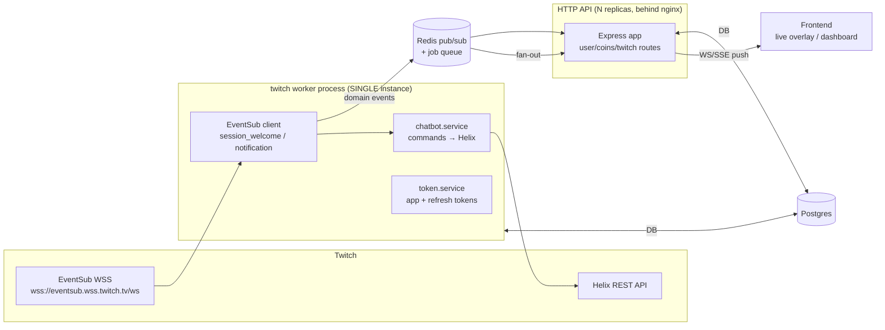

# Backend — Possible Target Architecture

> _Generated by plan from **Evgenii Perov** 🧑‍💻 with the Claude Code robot 🤖 ৻( •̀ ᴗ •́ ৻) ♡_

> **Status:** proposal / target. Prescriptive, not a description of `main`.
> **Audience:** senior. Trade-offs are stated, not hidden. The five structural calls are now ruled on — see [Decisions (resolved)](#decisions-resolved-2026-05-23); inline **✅ Resolved** tags point back to them.
> **Constraints:** Express 5, TypeScript (ESM, NodeNext), Prisma 7 + `PrismaPg` driver adapter, PostgreSQL. Designed to absorb the Twitch real-time scope the README implies.

---

## Contents

1. [Where we are now (baseline)](#1-where-we-are-now-baseline)
2. [Express 5 ground rules we build on](#2-express-5-ground-rules-we-build-on)
3. [Organising: layered vs modular](#3-organising-layered-vs-modular)
4. [The layers and the dependency rule](#4-the-layers-and-the-dependency-rule)
5. [Cross-cutting concerns (the `shared/` layer)](#5-cross-cutting-concerns-the-shared-layer)
6. [The Twitch real-time architecture](#6-the-twitch-real-time-architecture-the-part-that-actually-shapes-this)
7. [Proposed target tree](#7-proposed-target-tree)
8. [Incremental migration path](#8-incremental-migration-path-no-big-bang)
9. [Decisions (resolved)](#decisions-resolved-2026-05-23)
10. [Sources](#sources)

---

## 1. Where we are now (baseline)

```
src/
├── index.ts                 # app bootstrap + listen
├── config/index.ts          # env loader (getEnv)
├── routes/{index,user.routes}.ts
├── controllers/user.controller.ts
├── services/user.service.ts
├── lib/prisma.ts            # PrismaClient + PrismaPg(pool)
└── generated/prisma/        # prisma-client output (gitignored, compiled to dist)
```

Honest read of today's code:
- Layering is **clean and unidirectional** (`index → routes → controllers → services → lib`). Good bones.
- Two leaks/gaps for a senior eye: the controller switches on Prisma's `P2002` (ORM detail in the HTTP layer), every handler hand-rolls `try/catch`, there is no central error middleware, no `/health`, no graceful shutdown, CORS is fully open, and logging is `console`.
- It is **layer-by-type**, which is correct *at one entity*. The README's Twitch ambitions are what justify changing it — not current size.

This document describes the shape to grow into, and the path to get there incrementally.

---

## 2. Express 5 ground rules we build on

Express 5 changes two things that shape the whole design — worth stating because they invalidate common Express 4 advice:

1. **Async errors auto-forward.** A rejected promise / thrown error in an `async` handler is passed to the error-handling middleware automatically. The Express-4 `asyncHandler`/`express-async-errors` wrapper is **no longer needed**. Handlers can be plain `async (req, res) => …` and just `throw` — the global error middleware catches it.
2. **`req.params` / wildcard routing changes** (named wildcards, no more bare `*`), and `res.status(...).json()` is still the response contract. Path-to-regexp 8 underneath.

Everything below assumes: handlers throw domain errors, **one** terminal error middleware translates them to HTTP. No silent catches.

---

## 3. Organising: layered vs modular

You asked to see both. Here they are with the trade-off, then my pick.

### Option A — Layered (by technical role)

```
src/
├── routes/        controllers/     services/
├── repositories/  middleware/      lib/
├── config/        errors/          types/
```

- **Pro:** dead simple, everyone knows it, minimal ceremony, great while there's ~1–3 domains.
- **Con:** a single feature is smeared across 5 sibling folders. Adding "coins" or "twitch" means touching `routes/`, `controllers/`, `services/`, `repositories/` in parallel. Cross-feature coupling is invisible. Hard to reason about a domain in isolation.

### Option B — Modular monolith (by feature, layers *inside* each module) ✅ recommended

```
src/
├── modules/
│   ├── user/        { user.routes.ts · user.controller.ts · user.service.ts · user.repository.ts · user.schema.ts }
│   ├── coins/       { … coin-history domain … }
│   └── twitch/      { eventsub.client.ts · chatbot.service.ts · token.service.ts · twitch.routes.ts }
├── shared/          # cross-module: middleware/, errors/, logger/, db (prisma), config/
├── app.ts           # buildApp(): wires middleware + mounts module routers (no listen)
└── server.ts        # HTTP entrypoint: imports app, listens, graceful shutdown
```

- **Pro:** a feature is one cohesive folder you can hold in your head, test, and delete. Bounded contexts are explicit. New domain = new folder, near-zero edits elsewhere. Matches where Twitch takes this (clearly separable domains). It's also easier for an agent/LLM to work on one module without loading the whole tree.
- **Con:** more folders up front; you must police the **dependency rule** (modules talk through service interfaces / events, never reach into each other's repositories) or a "modular monolith" quietly becomes a big ball of mud with extra steps.

**Recommendation: Option B (modular), with the layered roles preserved *inside* each module.** Justification is the trajectory, not today's size: Twitch adds at least `twitch` (EventSub + bot + tokens), `coins`/economy, and likely `stream`/events as first-class domains. Modules give you isolation and testability per domain; you already prefer them. If this stayed a single-entity CRUD service forever, I'd say Option A — modules would be ceremony. It won't.

The two are not opposites: **a module is just a vertical slice of the same layers.** You keep route→controller→service→repository everywhere; you only change the *primary axis of grouping* from "type" to "feature".

---

## 4. The layers and the dependency rule

Inside any module, dependencies point **one direction only**:

```
HTTP in ─▶ route ─▶ controller ─▶ service ─▶ repository ─▶ Prisma ─▶ Postgres
                                     │
                                     └─▶ shared/errors, other module *services* (never their repos)
```

| Layer | Owns | Must NOT |
|---|---|---|
| **route** | path + method → controller, attach per-route middleware (validate, auth) | contain logic |
| **controller** | read `req`, call service, shape `res`. Thin. | know about Prisma, SQL, or error→status mapping |
| **service** | business rules, orchestration, transactions; throws **domain errors** | touch `req`/`res`; know HTTP status codes |
| **repository** | data access; the *only* place Prisma is imported | contain business rules |
| **schema** (`*.schema.ts`) | Zod request/response DTOs — re-exported from `@fox-sphere/shared-schemas` so the FE shares them | — |

**✅ Resolved (decision 3) — repository layer is thin / only where needed.** Prisma Client *is* already a repository/data-mapper. A separate `*.repository.ts` is justified only when you want (a) to keep Prisma out of services for DB-less unit testing, or (b) a seam for complex/reused or raw-SQL queries. Trivial CRUD services call `prisma` directly through `shared/db`. No repository-per-entity mandate (contra the skill's "always have a repository layer" — dogmatic repos are net-negative on Prisma). The `P2002`→`ConflictError` mapping still lives at the data-access boundary so ORM types never reach the controller.

---

## 5. Cross-cutting concerns (the `shared/` layer)

These are the gaps in the current code, expressed as the target.

**Error handling — domain errors + one terminal middleware.**
```ts
// shared/errors/app-error.ts
export class AppError extends Error {
  constructor(message: string, public statusCode = 500, public isOperational = true) {
    super(message); Error.captureStackTrace(this, this.constructor)
  }
}
export class NotFoundError extends AppError { constructor(m='Not found'){ super(m,404) } }
export class ConflictError extends AppError { constructor(m: string){ super(m,409) } }
export class ValidationError extends AppError { constructor(m: string, public errors?: unknown){ super(m,400) } }
```
```ts
// shared/middleware/error-handler.ts  — mounted LAST, after routers
export const errorHandler: ErrorRequestHandler = (err, req, res, _next) => {
  if (err instanceof AppError)
    return res.status(err.statusCode).json({ status:'error', message: err.message,
      ...(err instanceof ValidationError && { errors: err.errors }) })
  logger.error({ err, url: req.url, method: req.method })
  res.status(500).json({ status:'error',
    message: process.env.NODE_ENV === 'production' ? 'Internal server error' : (err as Error).message })
}
```
This kills the per-controller `try/catch` and the `P2002` leak: the **repository** maps Prisma's `P2002` → `throw new ConflictError(...)`; the controller and middleware never see ORM types.

**Validation** — Zod at the boundary via per-route middleware (`validate(schema)`), schemas sourced from `@fox-sphere/shared-schemas` so client and server share one contract. The current FE↔BE error-shape drift disappears once both sides import the same schema and the error middleware emits one stable shape.

**Config** — single typed `config` object, fail-fast on missing required env (already the pattern; just make the messages English and route `PORT` through the same helper). Never read `process.env` outside `config/`.

**Logging** — `pino` + `x-request-id` correlation, not `console`. Gate Prisma query logging to non-production.

**Security** — `helmet`, CORS **allowlist** from env (not `cors()` open), `express-rate-limit` on public/auth routes, `NODE_ENV=production`, run behind nginx/reverse proxy (per Express production guidance).

**Ops** — `/health` (liveness) + `/ready` (readiness: checks DB) for Docker/orchestration; **graceful shutdown** on SIGTERM/SIGINT (`server.close()` → `prisma.$disconnect()` → `pool.end()`).

**App vs server split** — `buildApp()` returns the configured Express app *without* listening; `server.ts` listens. This makes supertest integration tests trivial (no port) and lets the Twitch worker reuse `shared/` without booting HTTP.

---

## 6. The Twitch real-time architecture (the part that actually shapes this)

This is where a senior should push hardest, because it breaks the "just add routes" mental model. Twitch integration is **not** request/response — it's a long-lived ingestion pipeline plus outbound push.



The decisions that matter:

1. **✅ Resolved (decision 1) — EventSub consumer is a single instance.** An EventSub WebSocket is one persistent client session. If you run it inside the HTTP server and scale the API to N replicas, you open N EventSub sessions → **every chat event processed N times** (duplicate coin grants, duplicate bot replies). So the EventSub client + chat bot live in a **dedicated worker process that runs as exactly one instance** (or guarded by leader election / a Redis lock). Separate `server.ts` (HTTP, scalable) and `worker.ts` (Twitch, singleton), both importing the same `modules/twitch` + `shared/`. May co-run as one process in v1 behind the seam.

2. **✅ Resolved (decision 2) — outbound push backplane is v2 (Redis).** A coin/event arrives at the worker, but the user's WebSocket/SSE connection lives on some API replica. v2 adds a **Redis pub/sub backplane**: worker publishes → all API replicas subscribe → the one holding the client's socket forwards it. v1 is single-instance + in-memory behind the `shared/events` port, so push works without Redis until you scale out.

3. **Background jobs / economy.** Coin awards, XP, level-ups, periodic payouts are async work triggered by events. A queue (BullMQ on Redis) decouples ingestion from processing and gives retries/idempotency. Idempotency keys matter — Twitch can redeliver EventSub notifications.

4. **Token management.** App access token (client-credentials, refreshed on 401) for Helix; per-broadcaster user tokens (OAuth, refresh-token rotation) if acting on behalf of a channel. Store refresh tokens **encrypted at rest**. Lives in `modules/twitch/token.service.ts`.

5. **Testing the integration without Twitch.** The official **Twitch CLI** runs a mock EventSub WebSocket server + mock event payloads, and `tesjs` abstracts the EventSub handshake. Wire the worker against the mock in dev/CI.

How it maps to the modular tree: `modules/twitch/` holds `eventsub.client.ts`, `chatbot.service.ts`, `token.service.ts`; emitted domain events (e.g. `chat.message`, `channel.subscribe`) are handled by *other* modules' services (`coins`, `user`) — modules communicate via events/service calls, never by importing each other's repositories. That is the dependency rule paying off.

---

## 7. Proposed target tree

```
apps/backend/src/
├── server.ts                     # HTTP entrypoint (scalable)        ← buildApp().listen
├── worker.ts                     # Twitch entrypoint (singleton)     ← EventSub + bot + queue consumers
├── app.ts                        # buildApp(): middleware + mount routers, no listen
├── modules/
│   ├── user/      { *.routes, *.controller, *.service, *.repository?, *.schema }
│   ├── coins/     { … }
│   └── twitch/    { eventsub.client, chatbot.service, token.service, twitch.routes }
└── shared/
    ├── config/                   # typed env, fail-fast
    ├── db/                       # PrismaClient + PrismaPg(pool), $disconnect/end helpers
    ├── errors/                   # AppError + subclasses
    ├── middleware/               # error-handler, validate(zod), auth, rate-limit, request-id
    ├── events/                   # redis pub/sub + queue (BullMQ) wiring
    └── logger/                   # pino + correlation
```

Schemas (`*.schema.ts`) thin-wrap / re-export `@fox-sphere/shared-schemas` so the FE and BE never drift.

---

## 8. Incremental migration path (no big-bang)

1. Add `shared/errors` + global error middleware + plain throwing async handlers (Express 5 auto-forwards rejections) → delete per-controller `try/catch`; move `P2002`→`ConflictError` into the data layer.
2. Add `helmet`, CORS allowlist, rate-limit, `/health`+`/ready`, graceful shutdown, pino. (Pure cross-cutting; no module moves yet.)
3. Split `index.ts` → `app.ts` (`buildApp`) + `server.ts`. Add supertest integration tests against `buildApp()`.
4. Fold `controllers/services/routes/user.*` into `modules/user/`. One module, proves the pattern.
5. Add `modules/twitch` + `worker.ts` against the **Twitch CLI mock**; introduce Redis only when you add the second API replica or the first outbound-push feature.

Each step ships independently and leaves the app green.

---

## Decisions (resolved 2026-05-23)

All five ruled on. These are now the canonical choices the rest of the doc assumes.

1. **Worker split — ADOPTED.** Separate singleton `worker.ts` (EventSub + chat bot) from the horizontally-scalable HTTP `server.ts`. This is the best practice for any persistent-connection consumer (one EventSub session, processed once). *v1 may run as a single process* provided the Twitch consumer lives behind its own entrypoint/seam so it can be split out without touching module code.
2. **Redis — v2 (likely).** v1 ships **single API instance + in-memory** event bus and push. Mandatory: the pub/sub + job-queue are accessed through a **port interface** (`shared/events`), in-memory adapter now, Redis (pub/sub + BullMQ) adapter in v2 — swap is a config change, not a rewrite. No Redis code in v1.
3. **Repository layer — thin / only where needed (best practice for Prisma).** Services call Prisma directly (via `shared/db`) for simple CRUD. Introduce a `*.repository.ts` **only** when a service needs DB-less unit isolation or owns complex/reused queries. No repository-per-entity mandate. The `P2002`→`ConflictError` mapping still lives in the data-access boundary (a repo, or a small mapper) so it never reaches the controller.
4. **Module communication — public API + in-process event bus (best practice).** Each module exposes a public service surface via its barrel (`modules/<m>/index.ts`); synchronous reads = direct service call, **cross-module side-effects = domain events** through `shared/events` (`chat.message` → `coins` reacts). Modules never import another module's repository or internals. Same event interface becomes Redis-backed in v2 (decision 2).
5. **DI — constructor injection + composition root (best practice for plain Express).** Classes with constructor-injected dependencies, wired by hand in a composition root (`app.ts` + module barrels). Explicit, testable, no decorator/reflection magic. Express has no built-in DI; graduate to **awilix** (`scopePerRequest` for request-scoped deps) only when manual wiring becomes painful — not before. (`tsyringe` is the decorator alternative; full NestJS only if you want its whole framework, which we don't here.) Replaces the current functional module-level singletons.

---

## Sources

- [Express — Production best practices: performance & reliability](https://expressjs.com/en/advanced/best-practice-performance/)
- [How To Set Up Express 5 For Production In 2025 (ReactSquad)](https://www.reactsquad.io/blog/how-to-set-up-express-5-in-2025)
- [What's New in Express.js v5.0 (async error forwarding, routing)](https://www.trevorlasn.com/blog/whats-new-in-express-5)
- [Express.js Best Practices for Performance in Production (Sematext)](https://sematext.com/blog/expressjs-best-practices/)
- [Twitch — EventSub docs](https://dev.twitch.tv/docs/eventsub/)
- [Twitch — Example Chatbot Guide (EventSub WebSocket)](https://dev.twitch.tv/docs/chat/chatbot-guide/)
- [tesjs — Twitch EventSub for JS (WebSocket transport)](https://github.com/mitchwadair/tesjs)
- Internal skills: `nodejs-express-server`, `nodejs-backend-patterns`, `prisma-driver-adapter-implementation`, `prisma-client-api`.

---

_Generated by plan from **Evgenii Perov** 🧑‍💻 with the Claude Code robot 🤖 ৻( •̀ ᴗ •́ ৻) ♡_
